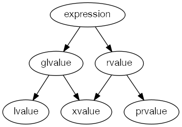

# lvalue vs rvalue 左值与右值

左值与右值在C++中与C语言中是不太相同的概念

深刻理解左值右值才能让你在进行内存开销优化时胸有成竹，而同时也可以帮助你优雅的实现许多安全逻辑检查

在C语言中，在一个有唯一副作用的赋值表达式中，赋值符号的左边的变量称为左值，右边每一项变量称为右值

例子如下

```cpp
int a;

int b;

int c;

a = b + c //b and c are rvalue, a is lvalue
```

lvalue在C语言中的含义是locator value(也就是定位符)而非left value，知道这个翻译问题有助于我们进一步理解，因为在C++中 难以理解的左值右值往往与赋值符号无关，而与原教旨的左右值性质有关

我们先继续讲C语言中的lvalue，在开始之前我们需要做一个事情，来让我们的讨论更加简单，那就是**假设C语言没有const关键字，即，你不能在高级源码层面指定一个变量是const的了，我们默认所有”有名字”的“变量都是真正的变量，都是可以改变的**（或者，你把const理解为**只能修改一次的变量**可能更好理解，下文中的常量都是指“真正的”常量）看到下面的例子，有汇编基础可能会更好理解

`a = 10;`

这里的a就是在前文被声明的变量, 他是有"名字"的, 名字叫a

10也是一个"变量", 但这里的变量指的是在源代码层面可以被程序员任意修改, 一旦经过编译就写死在汇编里面了:

`mov [a], 10`

这是直接写死在PE文件里面的, 写死在机器码里面的, 我们前文说过, 我们现在假设不能在高级源码层面指定一个变量是const， 但是在编译器层面, 编译器仍然有权限把一些数字写死到机器码 或者是只读内存区段中, 这些被高权限的编译器写死的常量有一个共同特点, 他们既不位于堆里面,也不位于栈里面

比如上面的 10 它位于PE文件中的`text`字段, 我们在这种情况下认为, 我们无法获得他的地址, 这样就和`rvalue`的标准定义对上号了

`rvalue`就是临时的常量(**需要保证一个前提,那就是C语言没有`const`关键字, 也就是说程序员无法手动定义常量, 下文会额外探讨`const`**)

这里的临时性指代的是只存在于机器码里面, 转瞬即逝,执行完就没法再次获取, 毕竟一般的程序不需要读取自身

这里的常量指代的是位于`text`节区

然后我们把C语言加上`const`关键字

那么rvalue的定义就变成了, 被编译器直接写在机器码里面的值。更准确的定义是：被主动或被动地静态确定的值都是右值

总结一下:C 语言中左值是为了对右值进行运算和定位, 从而给右值取的名字或者别名, 他是一个定位符

上面的例子中, a是10的别名, 如果我们:

```cpp
a = b + c; //b = 5; c = 5;
```

那么,a就是b+c的别名,我们如果print(a) 等价于print(b+c)

所以左值还有一个本质特性 他是一个表达式

所以, 在C语言中左值和右值的定义如下(每一条都是一个完善的定义)

左值是:

1. 定位符, 或者说是右值的定位符, 因为只有左值和右值, 他俩的并集组成全集
2. 别名
3. 表达式(重点, 后面C++部分会解释)
4. 所有`const`变量都是左值, 因为他们的本质是只能被定位一次的定位符, 他们必须被初始化(否则编译会报错), 且只能定位一次(否则编译会报错), 这种初始化发生于编译器编译时期, 这里为了简化讨论忽略了const指针的指针可以被改变的情况, 但是本质是一样的

右值是:

1. 除了左值都是右值
2. 一个被写死的值,最终会被编译器写死在机器码里面,而不会进入栈,所以无法对右值取地址(int\*a= &10;)
3. 一个产生来源没有副作用的纯值(产生这个值的原因不是赋值符)
4. 所有#define定义的常量都是右值, 他们的本质是一个产生来源没有副作用的纯值, 他们会被预编译器直接替换为一个产生来源没有副作用的纯值

接下来我们讲解C++中的`lvalue`和`rvalue`

这里需要注意的是, 在C++11中 值的分类 其实有五种, 所以上面的c语言中的 值的分类的 第一条性质被抹去了(除了左值的都是右值, 左值和右值构成全集)

实际上C++中有:

1. lvalue
2. rvalue
3. prvalue
4. glvalue
5. xvalue

他们的关系是：

```
    ______ ______
   /      X      \
  /      / \      \
 |   l  | x |  pr  |
  \      \ /      /
   \______X______/
       gl    r
```

这所有五个类型都可以用两个概念串起来:

1. Move Semantic 移动语义
2. 左值是一个表达式的结果或别名(至少他将来会是, 刚初始化时并不是, 因为还没有被定位 locate)

为了讲清楚移动语义，我想先讲一下swap函数的声明和实现，声明如下：

```cpp
template <class T>

void myswap(T& a, T& b)

{

//

}
```

我们来一步步实现一下swap，然后我相信你就可以理解为什么C++需要引入移动语义了

```cpp
template <class T>

void myswap(T& a, T& b)

{

if(& a == & b){

//ignore and do other thing

}

//normal branch

T tmp(a); //T的构造函数可能会很复杂，或者是内存占用很大，比如malloc(9999)

a = b;

b = tmp;

}
```

另外, 可能读者们曾经在一些面经中看到利用异或运算进行所谓的原地交换的swap，读者们可以思考一下，如果T不是基本类型的话，这种交换方式会产生什么额外问题（提示：异或运算会让内存中的内容按位（bit-by-bit）进行内存级的细颗粒度运算）

另一种理论上可行的办法需要大幅修改编译器对引用类型的变量的编译、解析逻辑

即：编译器提供一个buildin函数，他会对a和b这两个左值引用（或者说是定位符）进行编译时级别的重新引用（或者说是重新定位，重新分配他们的式子，成为别的算式的别名）

在高级语言级别上，我们可以观测到，这个重引用会产生内存波动，并且获得了广义右值的临时性特征

对于广义右值对象的消失有两种情况 1.到达了生命周期时仍然未被使用 2. 被另一个广义左值重定位(relocated)了, 此时的广义右值表现出和侠义右值相同的特性: 再也无法被第二次使用了, 并且在内存中(可以被认为)消失了

```cpp
template <class T>

void myswap(T& a, T& b)

{

// if (&a == &b) return;

T tmp(std::move(a));//std::move 返回一个转换成右值的实体

a = std::move(b)

b = std::move(tmp);

}
```

聊完了移动语义, 我相信读者们已经意识到了(如果没有也没关系, 我们再下面总结好了), C语言中的左值和右值分别具有多种特性, 有些特性构成了**狭义上**的左右值的内涵和外延, 有些特性则构成了**广义上**的左右值的内涵和外延

所以, 值的分类一共有 广义左值（glvalue）、广义右值（rvalue）、狭义左值（lvalue）、狭义右值（prvalue）、匿名值（xvalue）（或者可以叫他摇摆值，这个东西其实没有一个好译名，本系列应该不会讨论他，因为对于他的讨论不属于本系列的目标）

下面的图可能会让你更好理解他们的关系，以及为什么我在前面花费了大量篇幅讲解**表达式和左值的关系**

********

另外，为了让你更深刻理解，这里节选翻译一段[Mohan](https://stackoverflow.com/a/38559710/1433373) 的备忘录，他是C++早期标准的起草人之一

翻译仅供参考，有条件的请阅读原文（在本文末尾的附录里面）：

当你看到

`int&& a = 3`,

很容易将 `int&&`视作一种类型并得出结论`a`是一个右值。其实它不是右值：

```cpp
int&& a = 3;

int&& c = a; //error: cannot bind 'int' lvalue to 'int&&'

int& b = a; //compiles
```

**`a`有一个名字**（译注：所以他不是一个摇摆值或者说匿名值）并且事实上是一个左值（参见第二行代码的error）。不要将`&&`视为 类型的一部分，它只是告诉您`a`允许绑定的内容。

`T&&`这对于构造函数中的形参尤其重要。如果你写

`Foo::Foo(T&& _t) : t{_t} {}`

您将复制`_t`到`t`. 你需要告知编译器，形参`_t`需要绑定的内容是右值，但是 `_t`本身是一个左值

下面这样写才是正确的

`Foo::Foo(T&& _t) : t{std::move(_t)} {}`

``

关于左右值的论述基本就到这里了，可能还有缺漏的地方，欢迎指出，但是现有内容已经基本足够cover我们整个系列后面所需的关于左右值的知识点了

总结：

1. C语言和C++中的左右值的含义完全不一样，在讨论这个名词之前需要先明确上下文
2. C语言中的左值指的是C++中的**狭义左值**，C语言中的右值指的是C++中的**广义右值**
3. C++中共有四种情况下的左右值，以及一个匿名值，他们分别对应C语言上下文中的左右值的部分/完整 性质，这些性质紧抓两点即可 1. 定位符 2. 表达式
4. 如果你折腾半天最终也没有完全的搞明白这一系列概念，记住一点，右值会被优雅的销毁，如果你编译原理的基础不是很好，或者你java经验多于C++，你可以简单认为是一种GC，它常常被用于优化，左值和右值之间的转换也常常被用于优雅的实现大开销算法，**这种优雅的销毁可以让你轻松而优雅的实现某些需要很复杂逻辑才可以实现的安全检查和安全收尾工作**，这也是为什么我讲这个东西的原因

## 延申阅读

本小节的延申阅读部分建议全部仔细翻阅一遍

[C++移动语义及拷贝优化 | 阿振的博客](https://theonegis.github.io/cxx/C-%E7%A7%BB%E5%8A%A8%E8%AF%AD%E4%B9%89%E5%8F%8A%E6%8B%B7%E8%B4%9D%E4%BC%98%E5%8C%96/index.html)

[如何：定义移动构造函数和移动赋值运算符 (C++)](https://learn.microsoft.com/zh-cn/cpp/cpp/move-constructors-and-move-assignment-operators-cpp?view=msvc-170)

[What are rvalues, lvalues, xvalues, glvalues, and prvalues?](https://stackoverflow.com/questions/3601602/what-are-rvalues-lvalues-xvalues-glvalues-and-prvalues)

[What is std::move(), and when should it be used?](https://stackoverflow.com/questions/3413470/what-is-stdmove-and-when-should-it-be-used)

[Value categories](https://en.cppreference.com/w/cpp/language/value\_category)

[https://docs.google.com/viewerng/viewer?url=https://www.open-std.org/jtc1/sc22/wg21/docs/papers/2010/n3055.pdf](https://docs.google.com/viewerng/viewer?url=https://www.open-std.org/jtc1/sc22/wg21/docs/papers/2010/n3055.pdf)
